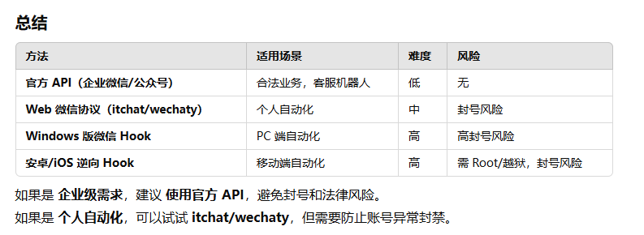
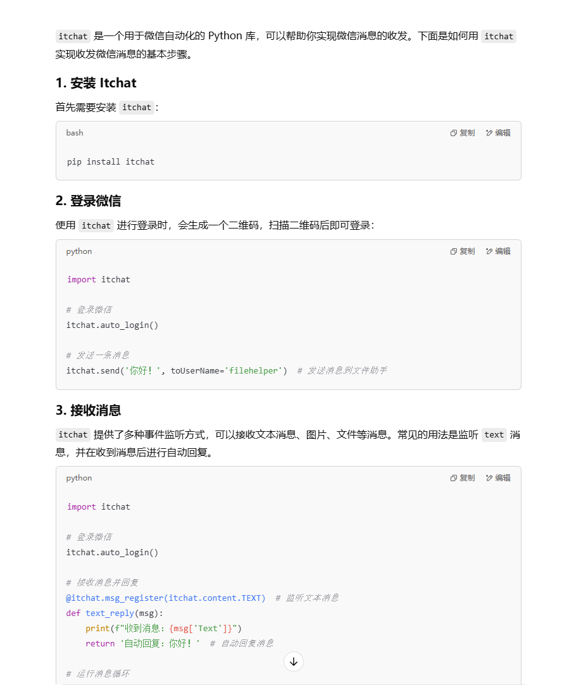
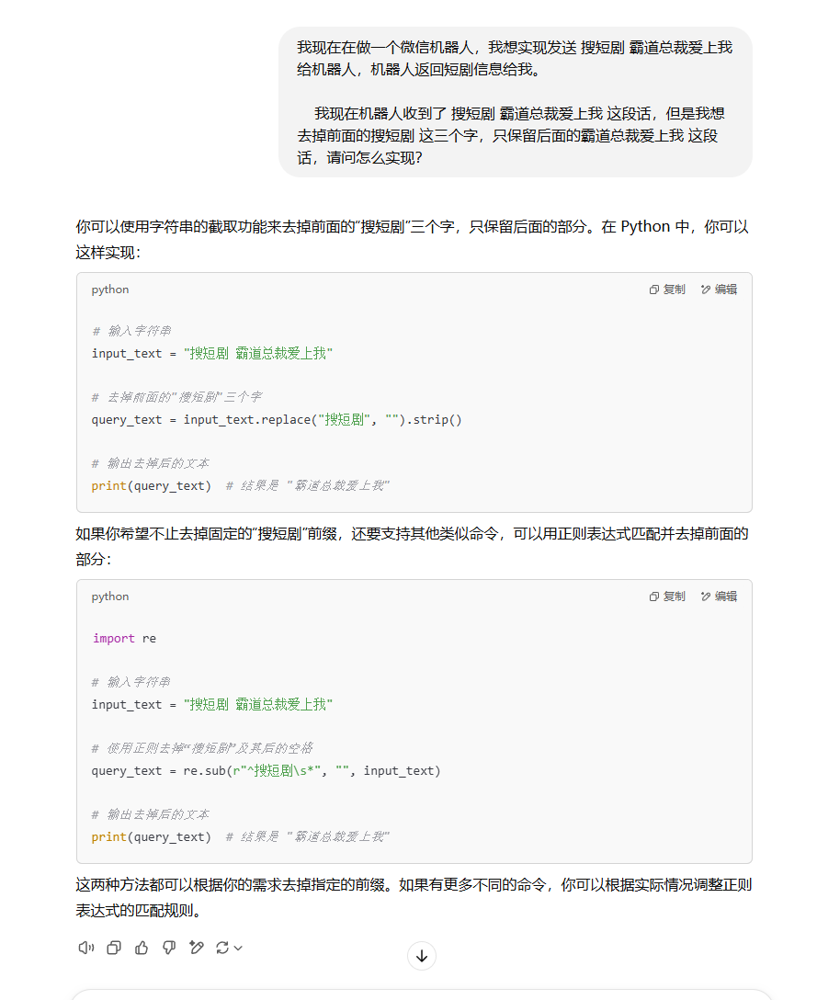
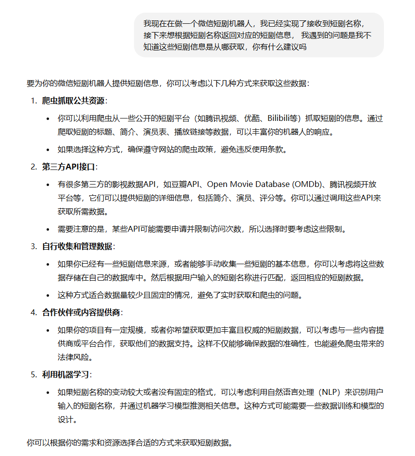
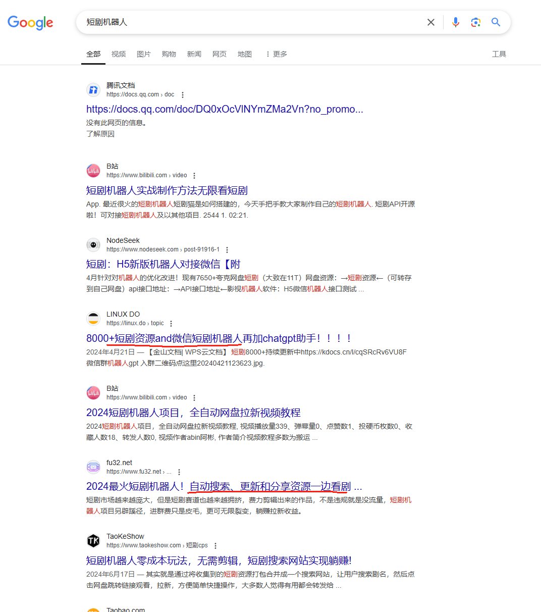
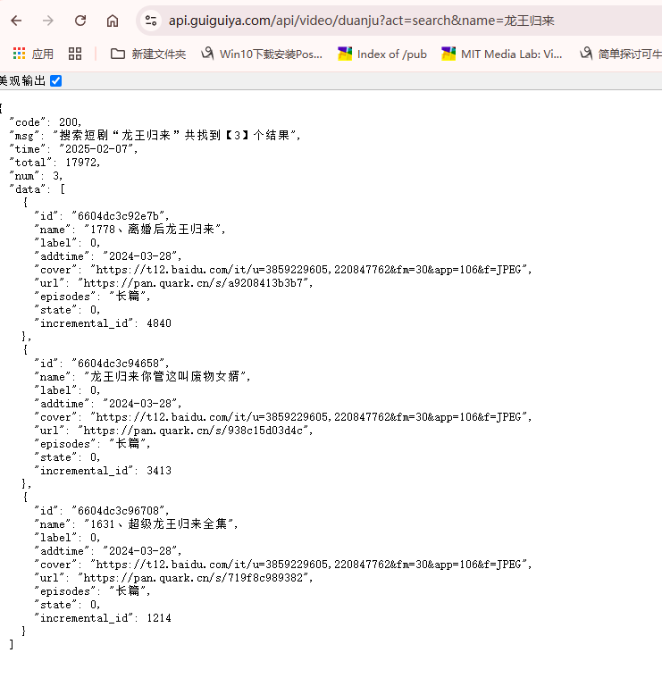
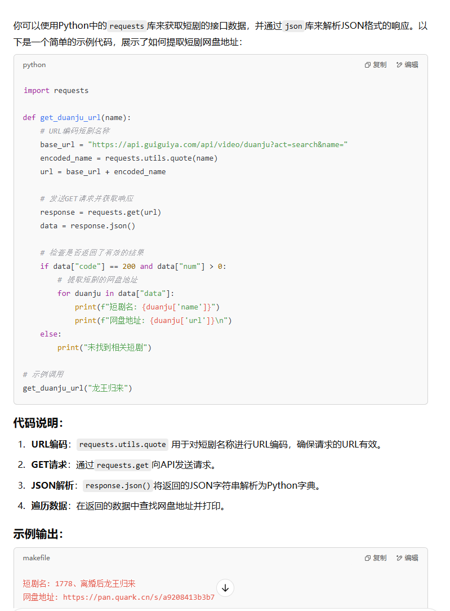

# 学习编程的思维方式

学习编程的核心能力我个人觉得是拆分问题的能力，能把一个大的问题拆分成多个小的问题，然后逐步解决。

如何拆分问题，拆分成什么样的问题，就需要了解相关的背景知识。


使用 AI 的好处就是，他可以根据我们的简单的需求描述，结合我们不知道的背景知识，给我们提供拆分问题的思路。最后每个问题就对应了具体的知识点，再利用AI对具体知识点进行学习，然后再使用AI来解决问题的时候做到心中有数。


其实这种思维方式，在AI出现之前，我们已经在用了，只是AI让我们的学习效率更高了。

单纯文字描述有点虚，后面的课程中我会以编程为例，实战中给大家分享如何使用AI来学习编程。

## 如何使用AI来学习

### 1. 不会什么就问什么

我们的第一直觉是觉得有了AI，自己就什么都会了，因为不会的就可以问AI。

其实不然，仔细想想，我怎么知道自己不会什么？

我不知道自己不会什么，我怎么知道问AI什么？


### 2. 学会提问

能提问的前提是，我有了一个目标，对他做了分析和思考，发现自己有疑惑的部分，然后针对疑惑的部分提问。

所以提问本身就是对问题的理解和分析，之后所产生的疑问，需要去验证的部分。以前是借助搜索引擎，只是现在多了AI这一种渠道罢了（切记：AI有可能乱说。正所谓：尽信书不如无书，以最终实践为准）。

### 3. 学会验证

验证的前提是，我已经知道了问题的答案(可能是AI的回答，或者搜索的答案)，只是需要去验证这个答案是否正确。这样可以在大脑中形成正确的认知，从而形成知识。

编程中的验证，就是自己动手敲代码，运行看效果。

只需要搭建对应技术需要的运行环境就可以验证，基本上有手就行，是非常容易验证的事情。

# 实现一个微信短剧搜索机器人

假设我自己不懂编程，我从实际例子来展示整个思考和操作过程。理解之后完全可以举一反三。

就把下面的内容当作 我的内心独白来看即可。

由于我不是纯小白，所以真的很难做到完全忘记自己会编程

有的东西已经融入思维的一部分。就像学会骑自行车这辈子都忘记不了一样。

因此：如果你看完之后，觉得我的某些思考步骤跨度太大，并不是一个新手能想到的，请告诉我，我做一下改进。


### 需求分析

微信机器人有哪些功能？

首先抛开技术细节，让我想象一下机器人做好了是怎么样的效果。反正后面具体技术不懂再问AI。

从整个项目功能来看，主要就是 我可以发一个短剧的名字给他，他返回短剧的观看地址给我。

比如我发：`搜短剧 特拉普爱上白宫做保洁的我`

机器人返回：

    
    短剧名称：特拉普爱上白宫做保洁的我
    短剧地址：https://pan.baidu.com/s/1234567890
    密码：123456
    

---

嗯没错，这就是我要的最终效果，现在看看从哪开始呢，可以先从哪里入手呢？

机器人要能给我返回短剧信息，那肯定是要能知道我发的信息，那写一个程序来**实现接收和发送微信信息**，这就是最基本的功能了，这个实现不了，其他都是扯淡。

---

等等，除了实现这个功能，我还需要做什么？

我还需要有个地方能得到短剧信息，短剧总不可能凭空生成吧。

我看很多短剧机器人都是返回的网盘地址，看起来好像是程序可以搜索网盘中的短剧信息，然后返回给我。

嗯 我整理一下流程，看看我需要做什么？

第一，程序需要能收发微信消息。

第二，程序需要能搜索网盘中的短剧信息。

---

目前好像没有什么遗漏的了，我们开始动手吧。

一个一个来，先看看怎么实现收发微信功能。我问问ai看，怎么问呢？

直接问：`怎么实现微信收发消息？` 看看AI怎么说。



嗯，根据回答，好像微信公众号最简单，不过好像不满足我需求，因为我看到别人的短剧机器人是可以在微信群里搜索的，公众号又没法拉进群。

---

再看web微信协议，这个适合个人自动化，难度中等，可以考虑。我们看看这个咋用的，先搞个例子实现以下简单的收发信息。搞定收发信息，再根据搜索关键词返回短剧信息，就搞定了，想想就激动，嘿嘿。

---

继续问ai：`itchat怎么实现收发微信消息？`



嗯，根据回答，好像很简单，就是先安装itchat，然后照着例子写代码。

---

但我不会写代码啊？这些代码怎么用？咋运行？怎么微信联系到一起？怎么就可以收发信息了？

等等 缓缓心情，看看上面的问题，一个一个攻克他。

python，这个我知道 虽然我不懂编程，但是还是听过，好像是一个编程语言，可以写爬虫啥的。

---

看来我需要先学习python，然后才能写代码。

于是我停下来，花了几天，问ai怎么学python，怎么运行python代码，找了一篇完整的教程，跟着教程走了一遍。还找了本书，跟着书走了一遍。

---

现在我对python已经算是初窥门径了，python语法也基本掌握了，可以开始写代码了。 

我来啦 我的短剧机器人

---

现在我再看上面ai的回答，so easy 啦，不就是先安装itchat库，然后照着给的代码复制到本地文件里面，用python运行一下么，不过如此。

嗯，经过我一番折腾，终于实现了登录微信，可以收发信息了。我只花了几天时间就从小白到技术大牛，我简直太牛了。

---

> 题外话：为了过程真实，我是真的现场搜索，根据ai回复来进行思考和操作，其实实现微信收发消息超级简单，懂python基础语法 十分钟就搞定了
>
> ai告诉我的这个框架是基于网页版微信的，网页版 很多新注册的微信是不支持登录的
>
> 其实另一个微信机器人框架更好用：[WeChatFerry 简称 wcf](https://github.com/lich0821/WeChatFerry), 这个框架更简单，更易用，更强大，是基于pchook原理的。
>
> 关于这个库，他官方有完整的文档。网上还有视频教程，再不会还可以加他官方微信群，里面有技术大佬解答问题。
>
> 我之所以知道这些，无非就是平时对这方面有兴趣，多花了一些时间去了解而已，你一样也可以的，这东西就是一个信息查罢了
> 


---

接下来就是要根据关键词返回对应的短剧了，我仔细想一下这个流程

我通过微信发一个短剧关键词给机器人，比如发：`搜短剧 特拉普爱上白宫做保洁的我`

我的机器人收到的是 `搜短剧 特拉普爱上白宫做保洁的我` 这个关键词

我得去掉前面的 `搜短剧` 这个关键词，然后剩下的就是短剧名称，然后根据这个短剧名称去搜索网盘中的短剧信息，然后返回给我。

咋去掉呢？

问问ai看，怎么问呢？

直接问：`怎么去掉前面的搜短剧 这个关键词？`

不对！！！ 因为这句话没头没尾的，去掉什么前面的？什么关键字？别说ai了，这句话单独拿出来 是个人都蒙。

那我的给他描述得更清楚一些？怎么样会更清楚呢？

我用最笨的办法，把我在做的事情从头到尾跟他说一下试试：

让我想想描述问题的思路。

**我现在在做啥 + 我做到哪了 + 接下来要干啥 + 我遇到了啥问题 + 怎么办**




对于已经学会python的我来说，so easy 啦，随便复制一个，然后运行一下，看看效果。不错，都可以。

现在我们已经得到短剧的名字了。

---

接下来就是根据短剧名字去搜索网盘中的短剧信息，然后返回给我。

看别的机器人都是返回网盘链接，那我要先把短剧都上传到我网盘？然后每个短剧链接都分享一下，整理一下，写在程序里面，根据上面得到的关键词去比较，找到了就返回。

这工作量有点大，我得想想怎么优化。 直接看看大佬怎么做的，问问ai看。

怎么问呢？没头绪，要不还是试试笨办法，把我需求描述清楚，看看ai怎么说。嗯，看来也只能如此了。

让我想想描述问题的思路。

**我现在在做啥 + 我做到哪了 + 接下来要干啥 + 我遇到了啥问题 + 怎么办**



爬取公共资源？这个超出我的能力范围了。我只是新手。

既然我有这个需求，会不会已经有人采集好了提供了接口呢？

嗯 我搜搜看，有没有现成的接口。

搜啥呢？ 

短剧机器人 我这样搜搜看，我不就是在做短剧机器人吗？看看这样搜有没有别人开源的 我好参考参考，真的是 之前怎么没想到呢




真是大大的惊喜，原来还有短剧资源，还自动更新的。真不错

经过一顿搜索了解，加一些群，我发现了别人有专门整理起来放到网盘，对外提供一个网址，直接把短剧名字提交到这个网址 就会返回短剧信息（包括网盘链接）。

真不错，这样我就不用自己采集了，直接用别人的接口就行。

---

通过在谷歌的一顿搜索，终于找到了一个短剧资源接口。

> 说实话，这个就是靠耐心和运气，多搜多尝试，多组合关键词搜索。如何搜索，其实也是学习能力很重要的一部分，这些都是需要积累的。

我在谷歌搜过的关键词如下：

```
短剧机器人资源
短剧api 
短剧api 夸克网盘
```

之所以在关键字加上夸克网盘，是因为群里看到的，有人分享的网盘链接都是夸克网盘的，他们做拉新，别人转存他网盘有钱赚，所以有人免费分享接口，为的就是让人转存文件，他们有收益。

---

> 该链接是临时查找的，仅供学习使用，如果失效了，请自行搜索。

```
http://api.guiguiya.com/api/video/duanju?act=search&name=龙王归来
```


接口返回的信息如下：



返回这些信息，有标题有图片，有网盘链接，看来就是我们需要的了，但是我怎么把这些标题和网盘链接提取出来呢？

提取出来，然后返回给我，我再通过微信返回给用户。就搞定了。

可惜啊，我是新手，我只有一个链接，我怎么让程序根据短剧名称去获取到短剧的网盘地址呢？

问AI咯。怎么问？

老办法咯。

**我现在在做啥 + 我做到哪了 + 接下来要干啥 + 我遇到了啥问题 + 怎么办**

提问内容如下：

```
我在做一个微信短剧机器人，现在需要根据一个短剧的地址去根据名字获取返回的短剧网盘地址，
我现在有短剧的接口地址：https://api.guiguiya.com/api/video/duanju?act=search&name=%E9%BE%99%E7%8E%8B%E5%BD%92%E6%9D%A5

name后面跟的看起来是短剧的名字

他返回的内容如下：
{
  "code": 200,
  "msg": "搜索短剧“龙王归来”共找到【3】个结果",
  "time": "2025-02-07",
  "total": 17972,
  "num": 3,
  "data": [
    {
      "id": "6604dc3c92e7b",
      "name": "1778、离婚后龙王归来",
      "label": 0,
      "addtime": "2024-03-28",
      "cover": "https://t12.baidu.com/it/u=3859229605,220847762&fm=30&app=106&f=JPEG",
      "url": "https://pan.quark.cn/s/a9208413b3b7",
      "episodes": "长篇",
      "state": 0,
      "incremental_id": 4840
    },
    {
      "id": "6604dc3c94658",
      "name": "龙王归来你管这叫废物女婿",
      "label": 0,
      "addtime": "2024-03-28",
      "cover": "https://t12.baidu.com/it/u=3859229605,220847762&fm=30&app=106&f=JPEG",
      "url": "https://pan.quark.cn/s/938c15d03d4c",
      "episodes": "长篇",
      "state": 0,
      "incremental_id": 3413
    },
    {
      "id": "6604dc3c96708",
      "name": "1631、超级龙王归来全集",
      "label": 0,
      "addtime": "2024-03-28",
      "cover": "https://t12.baidu.com/it/u=3859229605,220847762&fm=30&app=106&f=JPEG",
      "url": "https://pan.quark.cn/s/719f8c989382",
      "episodes": "长篇",
      "state": 0,
      "incremental_id": 1214
    }
  ]
}

请帮我用python代码提取一下
```

AI回复如下：



**这里有讲究**，为了不被之前的代码影响，我重新写了个文件，只复制这段代码，运行一下，看看效果。

---

啊。运行怎么报错了，我把错误丢给ai，哦原来是没安装requests库，使用ai给出的命令安装一下

运行成功

牛逼啊，这个函数直接使用，我只需要传入短剧名称，就可以返回短剧的网盘地址。

---

嗯 现在我把这个函数放到之前收发微信信息的地方，把收到的短剧名字传入这个函数，得到短剧的网盘地址，然后返回给用户。

完美。


## 总结

通过这个例子，可以看到，从头到尾我们几乎可以不写具体的代码。

但是 我们得能看懂代码，至少要知道哪一段代码是干嘛的，怎么运行的，怎么用的。

难吗？其实不难，你只需要知道，你想要什么，然后去描述你想要的东西，AI会根据你的描述，给出你想要的东西。

这些都是最基础的方法，当你有一定积累之后，就不必像新手一样去搜索，去问，你可以提出更加专业的问题，AI会根据你的问题，给出跟准确的回答。

我后面会出一系列的通用知识，让大家都可以快速的实现自己想要的产品。

## 扩展

其实技术不是问题，缺少的是想法和执行力。

比如这个短剧机器人，其实技术很简单

同样使用这个技术，你还可以实现：

- 小说搜索机器人
- 音乐搜索机器人
- 淘宝客机器人【这个之前做淘宝客花钱买过】

技术方面的东西，一通百通，底层的思维都是一样的。

## 最后

搞微信机器人有封号风险，请用小号。

