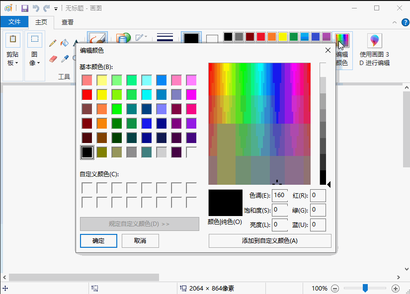
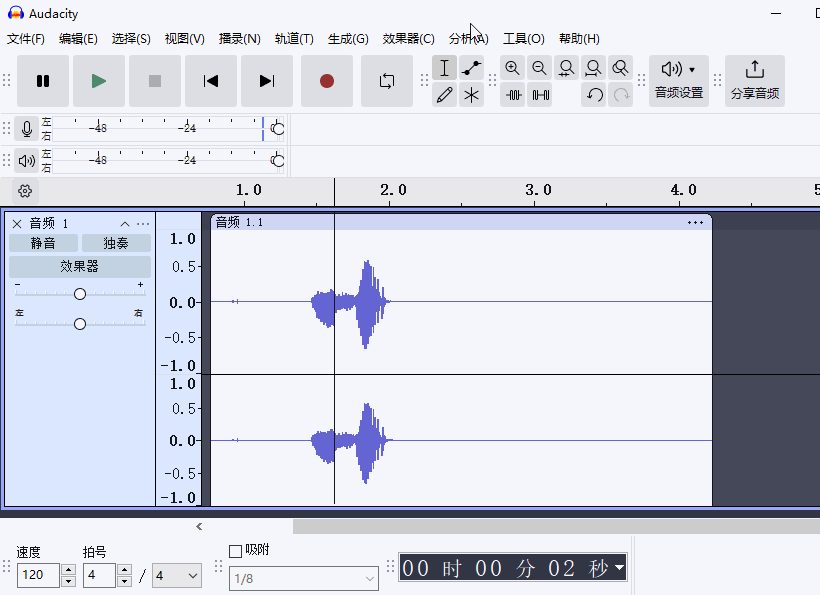

# 数据存储

## 电脑中如何用 0 和 1 来表示现实世界各种信息 

稍微了解一点电脑的朋友都大概知道，电脑里面的东西全是 0 和 1 组成的。

那么问题来了，为什么只用 0 和 1 来表示现实世界各种信息？

因为我们电脑底层是使用电信号来表示信息的，电信号只有两种状态：高电平（1）和低电平（0）。

所以这里的 0 和 1 其实表示的是两种状态。

## 数字在电脑中是如何表示的

既然电脑中只有 0 和 1，那怎么表示 2 呢？

你想一想我们生活中的数字也只有 0 到 9 这些数字，我们是怎么表示 9 以上的数字的？

答案是：**进位**

比如 9 再加 1 就变成了 10，这里的 10 就是 10 进制的表示。表示到达最大的数，就向前进一位，通过增加位数来表示更大的数。

上面就是逢 10 进 1，叫做**十进制**。

那么我们只有 0 和 1 表示两个数字，当 1 再加 1 的时候，就进位变成了 10。这里的 10 是二进制的表示。

上面就是逢 2 进 1，叫做**二进制**。

所以逢几进一，就叫做几进制。

**常用的有 2 进制，8 进制，10 进制，16 进制。**

* 2 进制使用 0-1 表示数字，
    - 一般表示为 0b 开头，比如 0b10 表示十进制的 2
* 8 进制使用 0-7 表示数字，
    - 一般表示为 0o 开头，比如 0o10 表示十进制的 8
* 10 进制使用 0-9 表示数字，一般不需要前缀，直接写数字即可
* 16 进制使用 0-9，a-f 表示数字。（字母不区分大小写）
    - 一般表示为 0x 开头，比如 0xa 表示十进制的 10

> 扩展知识：
> 
> 电脑中负数咋表示，小数又咋表示？问问 AI 吧，小数的表示法，不少程序员都不一定知道。
>
> 提示：可以找AI了解一下，二进制**原码**、**反码**、**补码**，以及 **IEEE 754 标准** 。

只需要知道，小数在电脑中是 **浮点数**。

**浮点数是无法精确表示的，所以电脑中表示的小数都是近似值。**

比如： 0.1 + 0.2 在电脑中不等于 0.3，而是等于 0.30000000000000004。

所以，在编程中，不要直接比较两个小数是否相等。 

也不要用浮点数去做货币相关的计算和存储。

货币相关的计算和存储，一般使用两种方式

1. 一种是使用整数表示(比如人民币：单位用厘，比如1.2元表示成1200)，
2. 另一种是使用**精确小数**表示。比如 python 的 decimal 库，java 的 BigDecimal 类。

## 电脑中如何表示文字

上面我们已经知道，通过二进制，电脑就可以表示所有的数字。

那么文字在电脑中是如何表示的呢？

毕竟文字也就是一个符号而已，意义是人为定义的。

所以，给每个文字一个编号，然后通过二进制表示这个编号即可。

比如：
| 数字编号 | 对应字符 |
|----------|----------|
| 1        | a        |
| 2        | b        |
| 3        | c        |
| 4        | 你       |
| 5        | 我       |
| 6        | 他       |
| 7        | 爱       |


那么，如果我想表示“我爱你”，那电脑上只要保存 5 7 4 三个数字就行了。

上面的规则是我们定义的，这个数字和字符的映射关系就会形成一个表，目前常用的表有：

* ASCII 表： 最早的表，只支持英文，一个字节表示一个字符。
* GBK 表： 支持中文，一个汉字用两个字节表示。
* UTF-8 表： 支持中文，一个汉字用三个字节表示。（现在最常用的表）

上面提到的字节，一个字节等于 8 个比特位。

电脑对数据进行读取和存储的时候，都是以字节为单位进行操作的，不存在半个字节的情况。

一个字节可以表示 2^8 = 256 个不同的数字。更大的数字就得多个字节表示。

字节的单位是Byte(大写B),比特位的单位是bit(小写b)。

1Byte = 8bit 也可以写作 1B = 8b

常见的单位之间的换算：

```
1Byte = 8bit
1KB = 1024B
1MB = 1024KB
1GB = 1024MB
1TB = 1024GB
```

> 课外知识：
> 
> 我们常说的宽带，比如 100M 宽带，其实是指 100Mbps(100 兆比特位每秒)，意思是每秒传输 100 兆比特位。
>
> 100Mbps = 100 / 8 = 12.5MB/s
>
> 所以 100M 宽带，理论下载速度是 12.5MB/s(12.5 兆字节每秒)。
>
> 上面单位中 B 的大小写，B 表示字节，b 表示比特位。


## 图片和视频在电脑中是如何表示的

图片是由一个个像素点组合显示，所以我们只要能表示一个点，也就能表示图片了。

而视频是由一张张图片组合显示，所以只要能表示一张图片，也就能表示视频了。

那么一个像素点，在电脑中是如何表示的呢？

如果图片是纯黑白的，那就很简单了，用一个比特位表示一个像素点。

0 表示白色，1 表示黑色。

如果图片是彩色的，那要表示的颜色就多了。

电脑中使用红、绿、蓝三种颜色组合来表示一个像素点。

我们常说的 RGB(Red, Green, Blue) 颜色，就是指这三种颜色。

不同颜色就是这三种颜色不同比例的组合。

比如：

* 红色：255, 0, 0
* 绿色：0, 255, 0
* 蓝色：0, 0, 255

一个像素点，在电脑中是用 3 个字节表示的。一个字节表示一种颜色的比例，范围是 0-255（因为一个字节有 8 个比特位，可以表示 2^8 = 256 个不同的数字）。

所以一个像素点，在电脑中是用 3 个字节表示的，所以一个像素点可以表示 256 * 256 * 256 = 16777216 种颜色，足够我们日常使用了。

看下面的调色板，就是表示不同颜色的比例。(只需要关注红绿蓝后面的值)



> 当然实际存储中，不会这么傻瓜式的按像素点存储。这样太浪费空间了。
> 
> 实际存储中，会使用**压缩算法**来压缩图片。
> 
> 比如：jpg，png，gif 等图片格式都会使用对应的算法来压缩图片。
>
> 有透明度的图片，在存储的时候，除了红绿蓝三种颜色，还会存储一个透明度，叫做 RGBA 颜色，这里的 A 就是透明度，也叫阿尔法(alpha)通道。透明度范围也是 0-255，需要一个字节来表示。


## 声音在电脑中是如何表示的

我们能听到声音，是因为物体振动带动空气振动，形成声波。声波通过空气传播，进入我们的耳朵，引起鼓膜振动，然后我们就能听到声音了。 

电脑的麦克风，就是采集声音的振动，然后转换成电信号。

电脑的扬声器，就是将电信号转换成声音的振动。于是就播放处声音了。

所以我们电脑中要保存的就是麦克风采集到的电信号。

声音用两个维度来表示：

1. 振动的幅度
2. 振动的频率

如果用海啸来举例：

* 振动的幅度：海啸的高度
* 振动的频率：海啸的周期

看看下面这个图，就能理解振动的幅度和频率了，录音内容是：“你好”

下图是我把他放大后看到的效果，就是一个一个的点，每个点就表示采样了一次，他的横坐标是时间，纵坐标是振动的幅度。



声波在麦克风中产生的电信号是连续不断的，我们无法存储，因为1秒钟在现实中几乎可以无限分割，意味着 1 秒钟的电信号可以无限长，电脑需要无限个数字保存 1 秒钟的声波，这不合理。

好在我们人的耳朵精度有限，我们只需要每秒钟记录 8000 次，就能让人听起来不那么失真。 这个记录的次数就叫做**采样率**，单位是赫兹(Hz)。

很明显采样率越高，记录的声音越准确。像 CD 音质，采样率是 44100 Hz(44.1 kHz)，一秒钟记录 44100 次，很明显需要更大的存储空间。


同样这些采集后的数据，也会以一些格式进行压缩存储，比如 mp3，wav，m4a 等。

> 麦克风如何采集到电信号的呢？
> 
> 其实就是通过电磁感应原理。声音让一个很薄的膜振动，膜的振动带动电磁感应线圈振动，线圈在磁场中振动，就会产生电流。根据声音的大小，电流的大小也会变化。只要记录电流的大小变化，就能记录声音。
>
> 当然还有其他原理的麦克风，比如电容麦克风，压电麦克风等。


 


