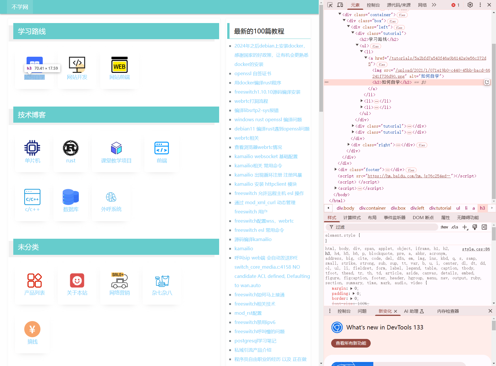
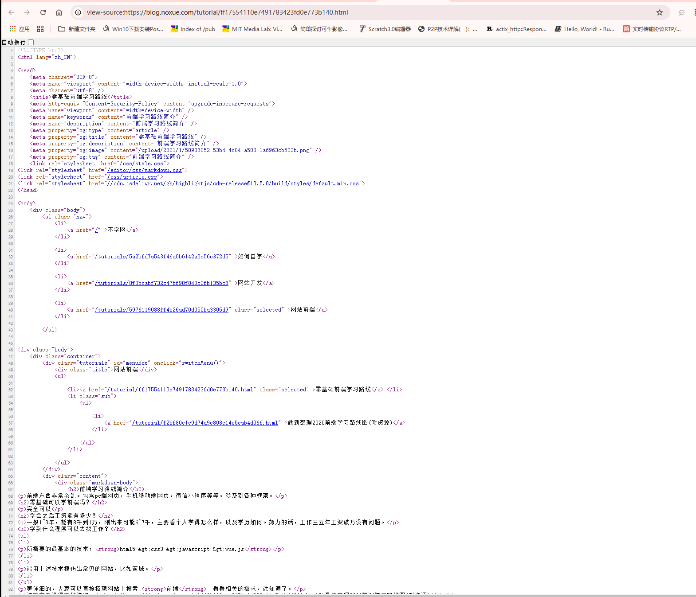
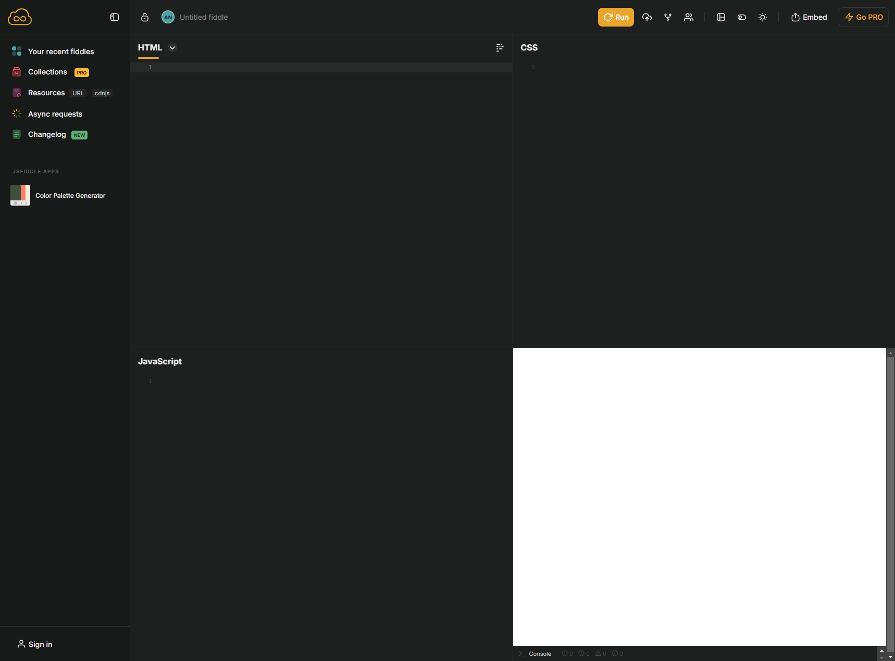
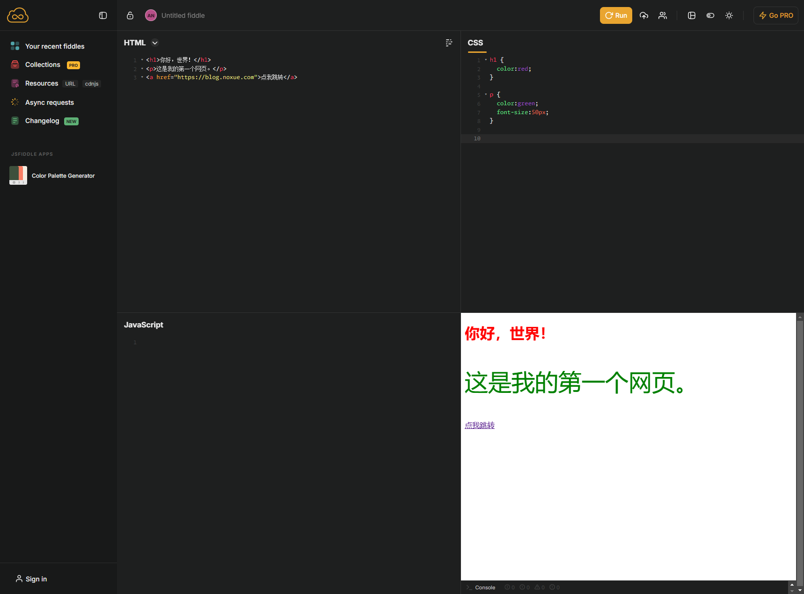
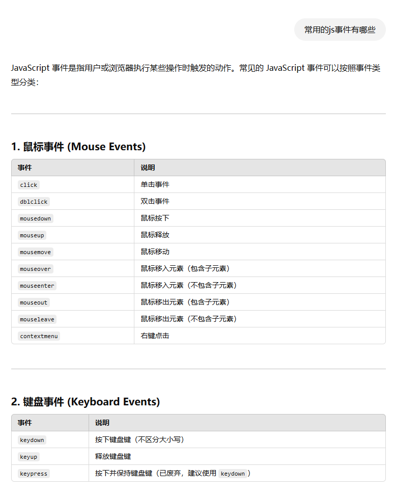
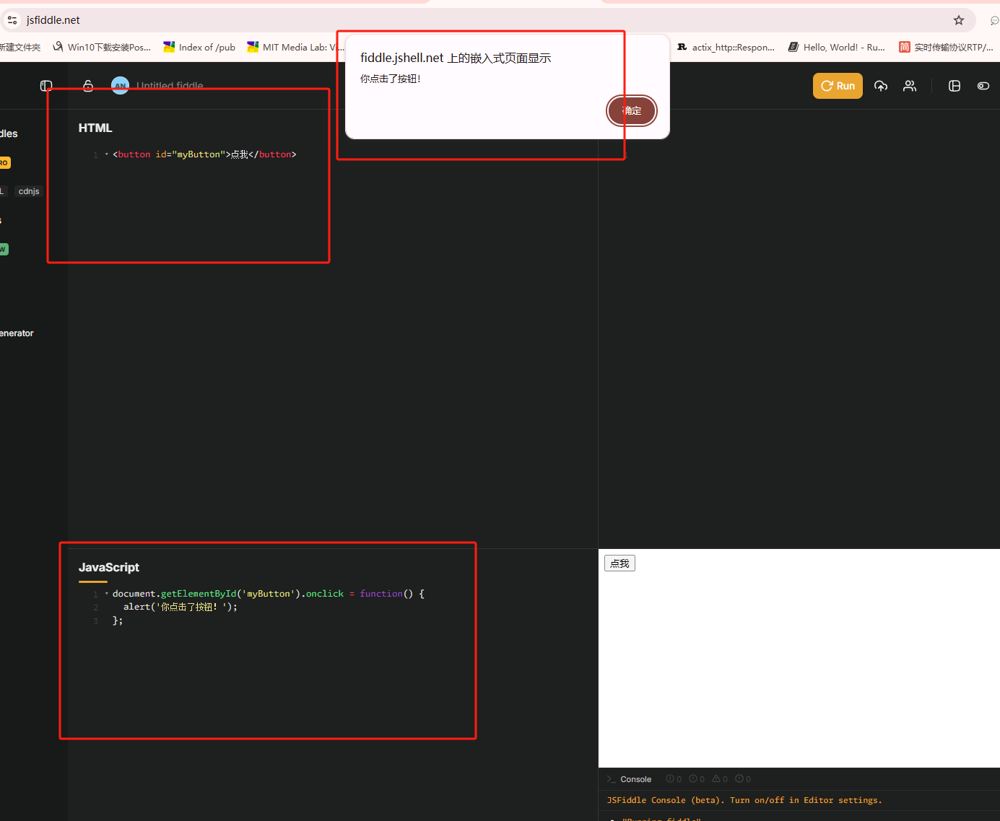
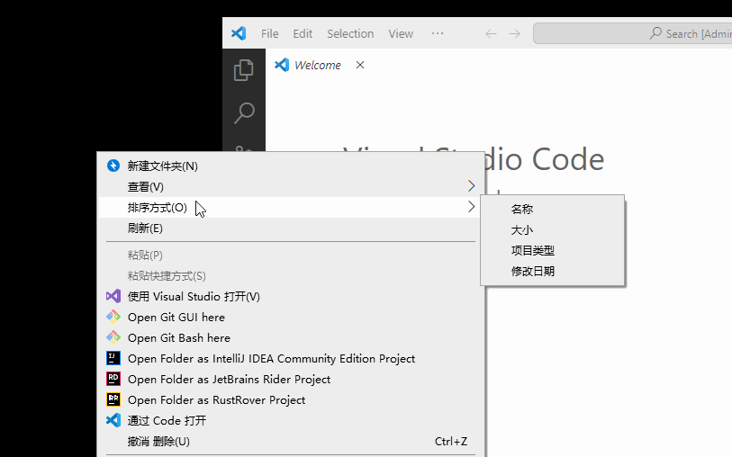
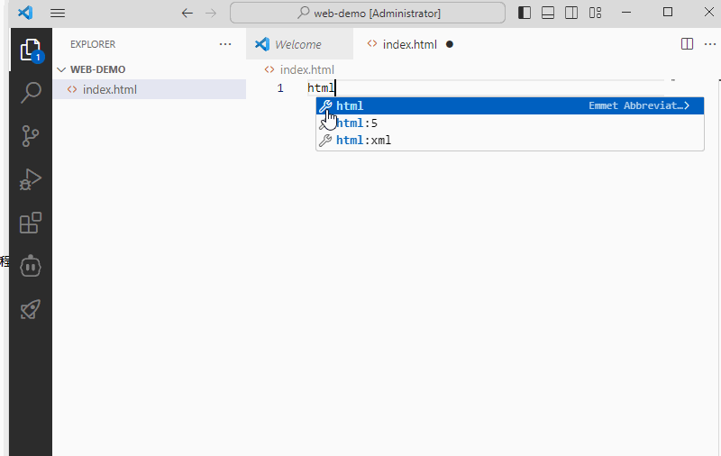
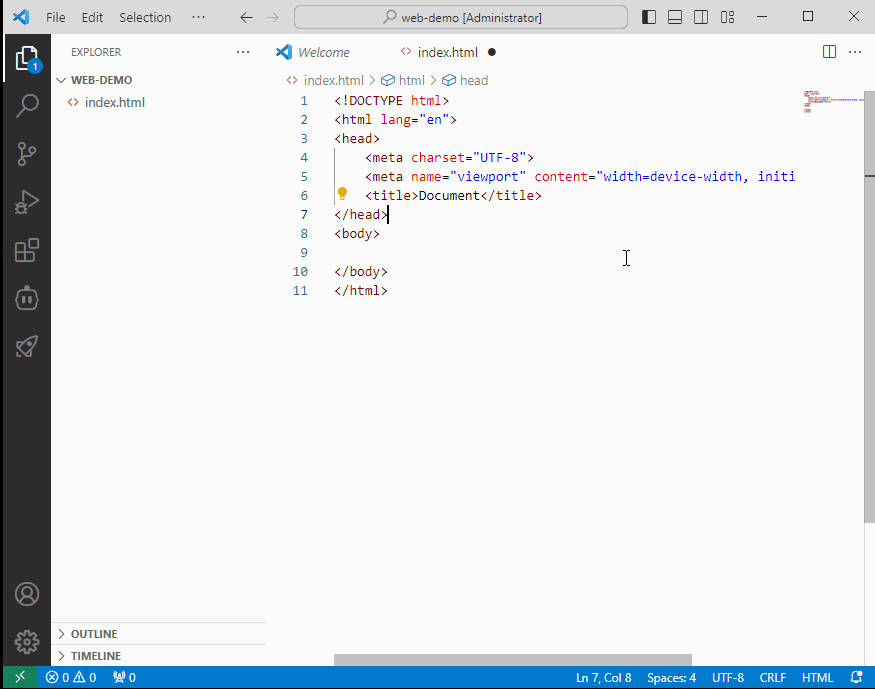
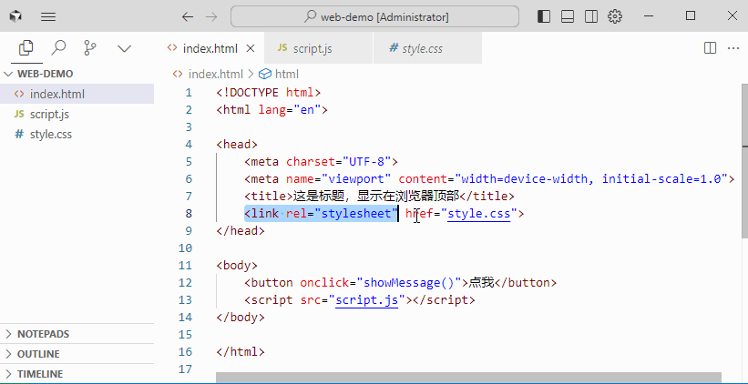

# 快速建立网页开发的基础概念

网页由 `HTML` + `CSS` + `JavaScript(简称JS)` 三个东西构成。

* HTML 组成了网页的基础，所有的文字，图片都是由 HTML 代码来表示。
* CSS 是用来美化网页，其实就是对 HTML 代码进行美化，控制 HTML 代码的显示效果，比如大小，颜色，位置。
* JavaScript 是负责执行逻辑功能的，比如 点击了网页上的按钮，该产生什么反应，这个就需要编写 JavaScript 代码了

### 简单总结

* HTML = 骨架 🏗️ → 没有它，网页不存在。
* CSS = 颜值 🎨 → 让网页更漂亮。
* JavaScript = 灵魂 ⚡ → 让网页“活”起来，能互动、能玩。

# 看看真实的网页代码


## 体验网页源码

我们打开这个博客网站 [https://blog.noxue.com/](https://blog.noxue.com/)

在网页上按键盘上的 `F12`， 会打开网页控制台，我们看看网页代码是怎么样的!



网页上的每个看得到的内容，在代码中都能找到与之对应的部分。

## 查看网页源代码

我们再随便打开一篇文章，再网页上**点击鼠标右键**，选择弹出菜单中的**查看源代码**，我们能刚看到如下的代码



上面的图中的就是html代码。看似很多很复杂，实际上仔细观察就会发现他们的规律。

* 所有代码都是 `<` 和 `>` 框住几个字母数字组成的，这种叫做html标签。

## HTML 基础

* 常用的 HTML 标签：
    * `<h1>` ~ `<h6>` (表示标题，和 word 文档的标题是类似的概念)
    * `<p>` (段落，和语文的一个段落，一段文字的意思)
    * `<a>` (链接)
    * `` (图片)
    * `<button>` （按钮）
    * `<div>` (区块，这个用得最多，一般就是用来分组用的)
    * `<table>` `<tr>` `<td>` （表格相关的标签，网页上看到的表格就是用这些标签组成）

    > 不需要刻意去记上面的标签和作用，有个印象即可，写几次自然而然就记住了。

### 动手试试

为了减少本地安装软件，我们先在线运行我们的代码，打开 [https://jsfiddle.net/](https://jsfiddle.net/)，打开后如下图：



界面是英文的，但是很直观，分 4 个区域，根据名字就知道作用，左上角写 HTML 代码，右下角是看代码运行效果，顶上有个按钮 **Run** 就是运行代码，写好了点击即可看到效果。

我们动手编写我们的第一个网页代码：
```html
<h1>你好，世界！</h1>
<p>这是我的第一个网页。</p>
<a href="https://blog.noxue.com">点我跳转</a>
```
> 建议照着上面的代码动手输入试试，输入完毕，点击 **Run** 按钮，右下角可以看到结果
> 
> 注意代码中 `<` 和 `>` 之间的空格也不可缺少
>
> **双引号** 是英文输入法状态输入的

### CSS 基础

我们先写一段css代码，美化一下上面的 HTML代码，看看效果

```css
h1 {
  color:red;
}

p {
  color:green;
  font-size:50px;
}
```

输入之后看看运行效果，都可以大致猜出这段css代码的作用了。



#### CSS 语法

```css
h1 {
  color: red;
}
```

* 通俗解释

    ```css
    控制哪个标签 {
        控制他的什么属性: 控制成什么;
        可以同时控制无数个属性
    }
    ```

* 专业解释：
    ```css
    选择器 {
        属性名: 属性值;
    }
    ``````

* **选择器**：表示要控制哪个html标签
* **属性名**：表示要控制标签的什么属性，比如：文字颜色，文字大小等。
* **属性值**：表示对应的属性的值，比如：颜色绿色，大小50像素（px就是像素的意思）

> 所有css语法都是上面这样的格式，都是大同小异。
> 
> 其中知识点最多的就是 选择器，这个我们后面说。


### JavaScript 和 HTML 结合

#### html 和 js 放在一起

代码如下：
```html
<button onclick="alert('你点击了按钮！')">点我</button>
```

效果也超级简单，点击按钮就弹出一个框显示 **你点击了按钮**

代码中的 `alert('你点击了按钮！')` 就是js代码

`onclick=""` 表示当这个 html标签 被点击的时候 后面双引号中的 js 代码 就会运行。

其实就是 `on(当)` 和 `click（点击）` 两个单词组合， 这种叫做 **事件**，**click** 就是点击事件，所以网页其实就是在等待用户对他进行一些操作，这些操作就是一个一个的事件，比如鼠标移动，键盘按下松开，点击右键，所有的操作都有对应的事件，我们只要用类似的写法，就可以在对应事件发生的时候执行我们写的js代码，从而实现和用户的交互。

常见的事件有很多，前往不要死记硬背，用的时候直接问ai（常用的js事件有哪些）：



具体哪个事件不会用，还可以让 AI 给出例子。


#### html 和 js 分开

上面的例子只有一行代码，和html放在一起还没什么关系，实际开发中，基本不会写在一起，而是分开写。

html代码：
```html
<button onclick="showMessage()">点我</button>

<script>
function showMessage() {
  alert('你点击了按钮！');
}
</script>
```

> 注意：js代码要写在 `<script>` 标签中。
> 
> function 是定义一个函数，showMessage 是函数名，() 是函数参数，{} 是函数体，里面就是放js代码。
> 
> 函数定义好之后，通过 `onclick` 事件来调用。

#### html 和 js 彻底分开 到不同文件
html代码：
```html
<button id="myButton">点我</button>
```

js代码：
```js
document.getElementById('myButton').onclick = function() {
  alert('你点击了按钮！');
};
```




> 上面不同的区域其实是放在不同的文件中的。我们下面会在本地写代码，就可以看到整个过程，知道他是如何把html和js以及css结合起来的 
> 
> document.getElementById('myButton') 是获取 id 为 myButton 的元素。
> 
> onclick 是事件，表示当这个元素被点击的时候，执行后面的函数。
> 


## 本地写代码

### 安装 vscode

安装教程：[vscode 安装](../tools/vscode.md)

在本地任何一个地方新建一个文件夹，比如我在桌面新建了一个文件夹 `web-demo`，然后打开 vscode，把文件夹拖到vscode打开，并创建一个html文件，比如 `index.html`。



### 代码放在同一个html文件

上面的代码其实只是核心部分，html网页有个基本的结构，我们把上面的代码放在这个结构中，就可以看到效果了。

在 vscode的 html 文件中输入 `html:5` 按下 `tab` 键，就可以生成一个基本的html结构。



然后我们的所有html代码，都放在 `body` 标签中。

下面我们来演示一下，如何把上面的 js 代码和 css 代码，放在本地文件中。

想看第一种，html js css 代码放到一个 html 文件中的方式



代码如下：
```html
<!DOCTYPE html>
<html lang="en">

<head>
    <meta charset="UTF-8">
    <meta name="viewport" content="width=device-width, initial-scale=1.0">
    <title>这是标题，显示在浏览器顶部</title>
    <style>
        h1 {
            color: red;
        }

        p {
            color: green;
            font-size: 50px;
        }
    </style>
</head>

<body>
    <button onclick="showMessage()">点我</button>

    <script>
        function showMessage() {
            alert('你点击了按钮！');
        }
    </script>
</body>

</html>
```

几个知识点：

* `<xxx>` 和 `</xxx>` 大部分是成对出现的，放在他们之间的内容，表示被包含在 `xxx` 标签中，比如 `<head>` 和 `</head>` 之间的内容，表示被包含在 `head` 标签中，`<body>` 和 `</body>` 之间的内容，表示被包含在 `body` 标签中。
* `<style>` 标签是放 css 代码的
* `<script>` 标签是放 js 代码的
* `body` 我们能看到的内容，几乎都是放在 `body` 标签中的
* 其他具体标签什么作用，可以直接问ai，比如问ai，**html中`<meta charset="UTF-8">`是什么意思**

### 代码分开



* css 代码放单独的文件 `style.css`，在html的 `<head>` 标签中，通过 `<link rel="stylesheet" href="style.css">` 引入，href指定css文件的路径
* js 代码放单独的文件 `script.js`，在html的 `<body>` 标签中，通过 `<script src="script.js"></script>` 引入，src指定js文件的路径
* 如果有多个css文件，可以引入多个，如果有多个js文件，可以引入多个
* 其他不变


### 学习 javascript

根据这个文档学习 [用AI快速入门任何语言](./language.md)

> 学习过程中，有任何问题，可以加群或加我微信交流
