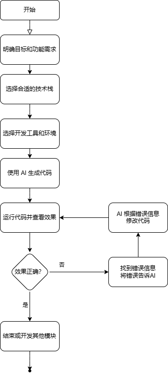

# 何谓通识

通识，是通用的知识，一种通用的能力，也可以说是常识。

我要和大家分享的就是如何用AI结合编程基础来编写出自己的产品。

我在网上见到过两种对AI的观点：

1. AI无所不能，只要你想，你就可以用AI来完成任何事情，人类再也不用学习了，比如再也不用学习英语了。
2. 觉得AI无大用，只能做一些不重要的项目，觉得不如自己写的代码靠谱。

说下我自己长期用AI编程的感受。
1. AI 并非无所不能，他只是可以增强效率，对于我一无所知的领域，我依然无法靠AI来完成，这时候必须得自己花时间深入学习特定领域的知识。
    1. 比如：要开发一个自己的编程语言，如果没有编译原理的知识，只靠AI我也毫无头绪。
    2. 其他跨行业就更不必说了
    3. 但是可以让AI增加我的学习效率，快速的学会特定领域的知识。
2. AI 可以让我更专注于业务逻辑，而不是底层实现。
   1. 我可以不写具体的代码，但是得大致知道他写的代码是干啥的，以及是否符合我的需求。
   2. 对此我感觉懂点技术的产品经理，以及懂点技术的测试人员，用AI编程会更有优势。

## 举个生活中的例子说明 使用AI 和 不使用AI 的区别

#### 以人走路为例

1. 不使用AI的时候
   1. 先确定要去的目的地
   2. 需要考虑自己先迈哪条腿
   3. 步子多大，朝哪个方向迈等等细节
   > 这个过程我们需要会控制脚，会控制腿，会控制方向，会控制步子的大小。（只是这些细节早已融入我们的下意识中，所以我们的大脑何尝不是对我们隐藏了具体细节的AI呢？让我们无需独立控制身体每一个细胞就能控制整个身体）

2. 使用AI的时候
   1. 告诉AI你的目的地
   2. AI会给你生成具体方案，比如面向对应的方向，迈出左脚，步子多大，迈完步子后，另一条腿怎么迈等等细节
   3. 你按照AI给的方案做，如果不是你要的效果，比如摔打了，或者方向错了，你告诉AI，他会根据你的描述重新调整方案，一直重复这个调整的过程，直到到达目的地。
   > 这个过程我们只需要知道按照AI给的方案执行是否离目的地更近，判断是否离目标更近的能力只是我们日常生活中的常识。
   > 
   > 所以我们想用AI来编程，也只需要掌握编程的一些常识性的知识即可。

## 下图是使用AI编程的流程

> 可以看出，其实大多数时间就是在测试AI写的代码，这真的很符合 **TDD(测试驱动开发)** 的开发模式。
>
> 而这个测试的过程，就需要我们懂点技术，懂点业务，懂点测试。这也就是我想表达的，懂点技术的测试人员，用AI编程会更有优势。
>
> 非技术人员，通过学会我分享的通用编程知识，也可以用AI去实现自己心中的产品。
>
> 这并非终点，在实践的过程中，你会掌握更多的知识，能做出更强大的产品。

