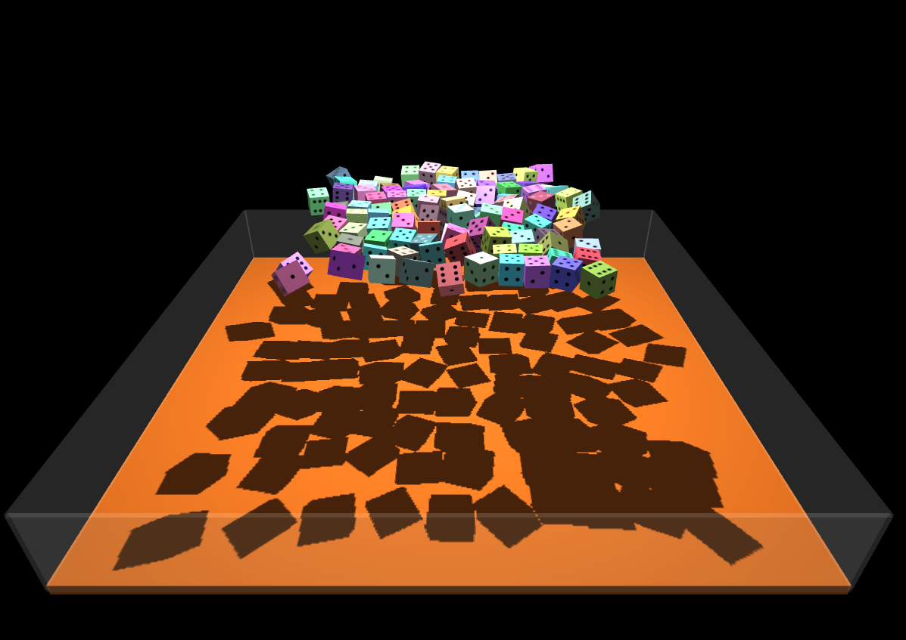
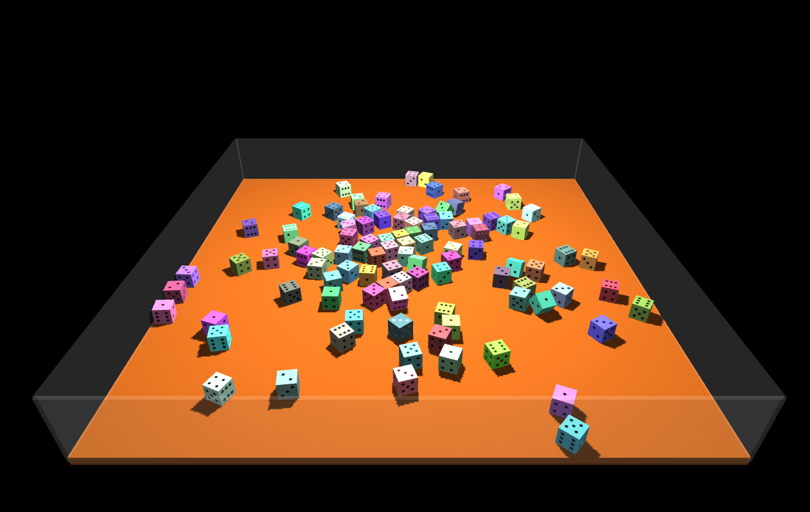
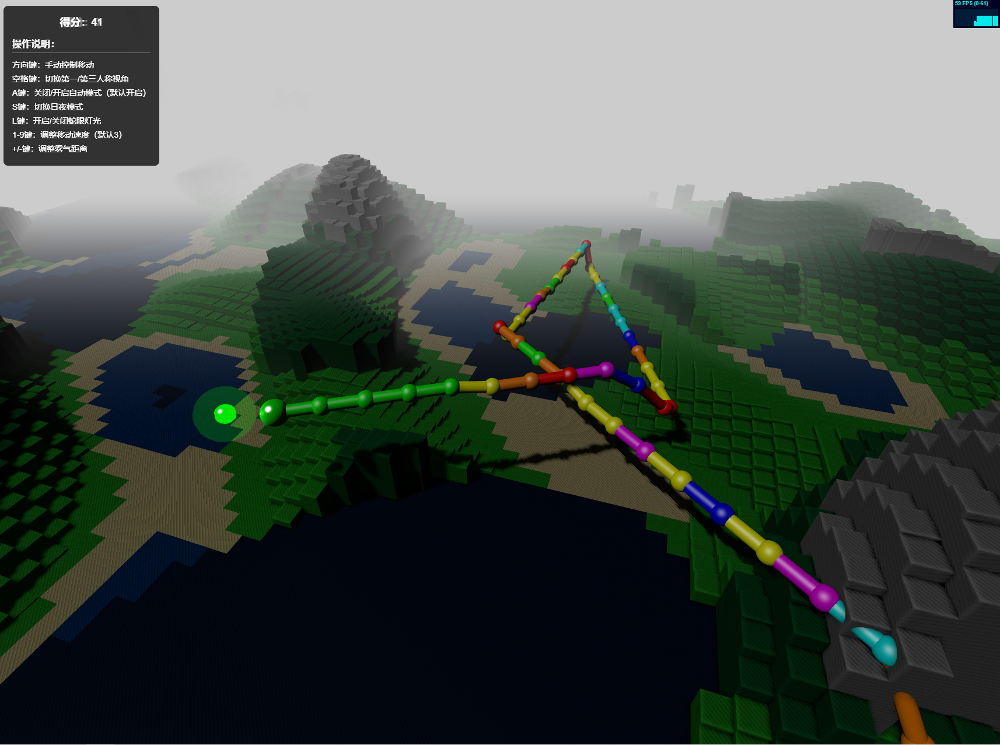
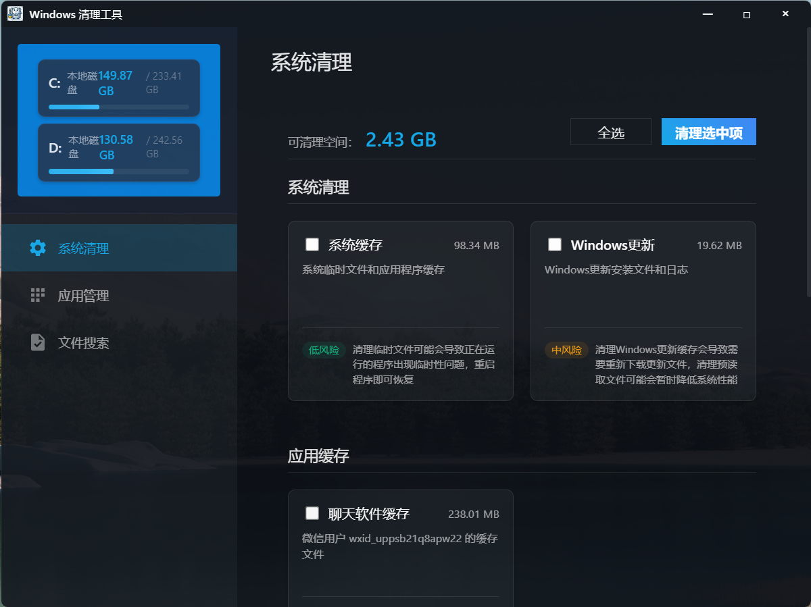
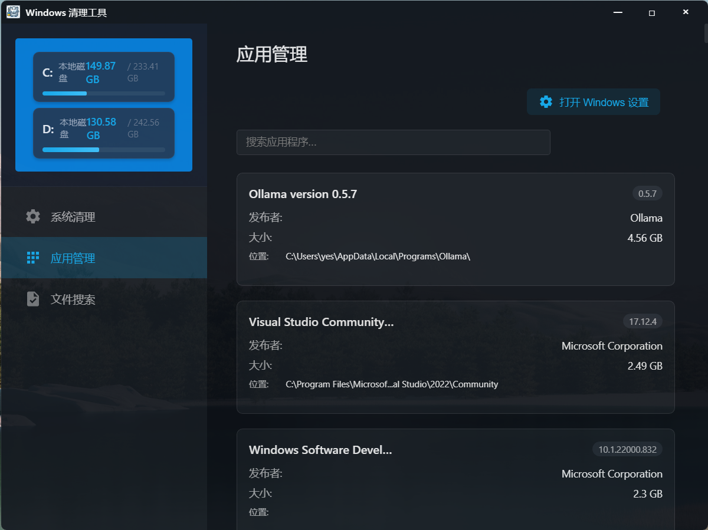
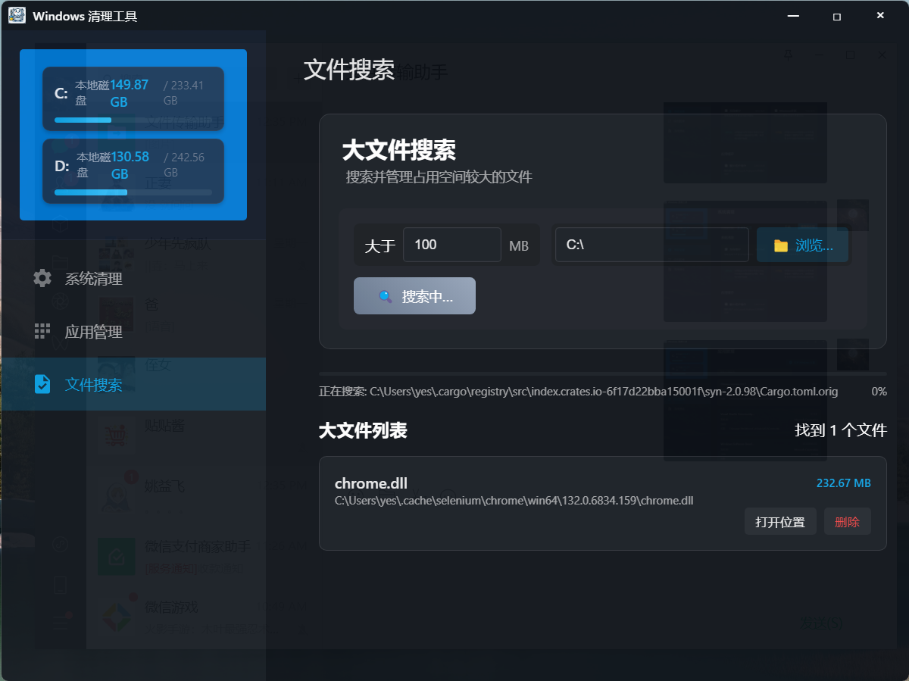

# 演示项目

以下项目纯ai编写（使用cursor)，几乎没手写代码，仅供搭建参考，了解一下目前ai的水平。

> 开发过程感受，虽然是全程AI编写，但是需要对具体技术稍微有所了解，报错之后才能靠感觉猜出大概什么错误，精准的表述给AI，AI才能比较好的修复问题。
>
> 其次就是，一定一定要用git做好版本管理，因为不知道AI哪次修改就导致整个项目崩坏，只能靠git回退到之前正常的状态。

* 简单加群页面(域名被微信屏蔽，复制到浏览器打开) [https://group.noxue.com/](https://group.noxue.com/)

    

* 掷骰子小游戏 [https://touzi.noxue.com/](https://touzi.noxue.com/)

    

    

* 3D 版本 贪吃蛇小游戏 [https://snake.noxue.com/](https://snake.noxue.com/)

    

* Windows 清理工具

    

    

    

