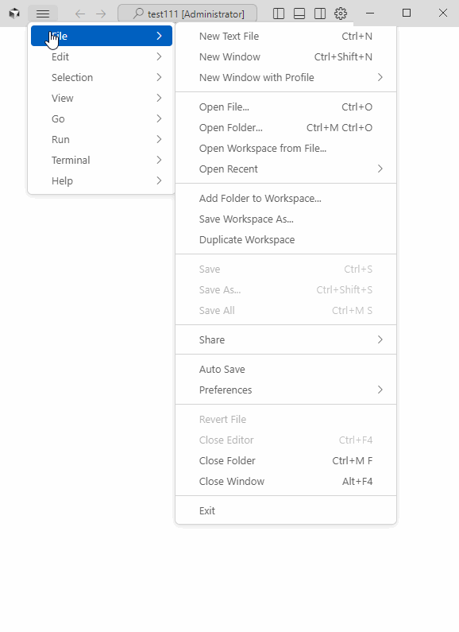
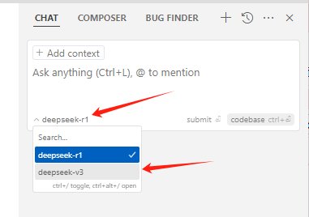
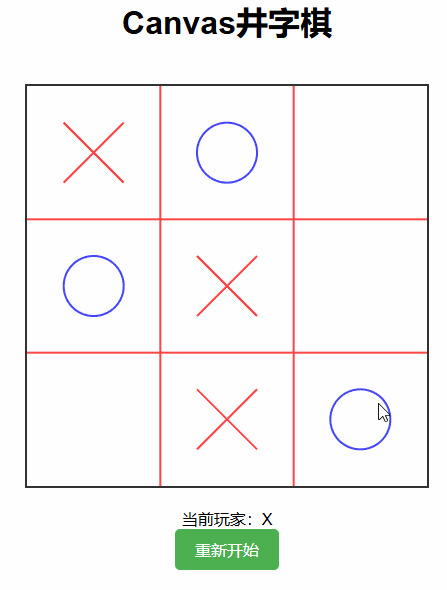

# cursor 如何配置deepseek模型

cursor 支持配置自己的模型 api，只要支持如下格式即可：

* openai api
* anthropic api
* Google Api
* Azure Api

> 注：所谓的API，其实就是一个规范，openai定好和大模型交互的规则，其他任何大模型只要遵循这个规则，就可以通过openai 一样的方式和大模型交互。比如我们可以通过openai的api调用deepseek大模型，就是因为deepseek提供了兼容openai的api。让用户不需要关心后端是什么大模型。

很多大模型也是提供了兼容openai的api，我们以阿里云部署的 deepseek 为例(腾讯了我测试了不行，不知道是不是我哪里操作不对)

## 缺点

不能使用Composer 模式，需要我们自己创建文件，复制粘贴代码到对应的文件。


## 优点

性价比高，各大厂家都在搞活动，几乎是免费使用。


## 申请API Key

[阿里云百炼大模型DeepSeek API 开放！百万 Token 免费领，手把手教你开通使用！](https://mp.weixin.qq.com/s/my52YY-0v3wJgYnQ0lgLNA)

## 登录cursor

最简单的是使用github账号登录，可以搞个github账号，用qq邮箱注册github账号都可以的。

注册地址：[gitHub.com](https://github.com/)

> 如果qq邮箱没收到验证码，注意检查qq邮箱的垃圾箱。

## cursor 配置 deepseek 模型
登陆后，按照下面gif操作。



* 去掉所有模型，只勾选 **deepseek-r1** 和 **deepseek-v3**
* 配置阿里云获取到的API Key 
* 配置API Base URL：`https://dashscope.aliyuncs.com/compatible-mode/v1`
* 点击 `Save` 保存
* 点击 `Verify` 验证，没报错就可以正常使用了


> 写代码用 **deepseek-v3**  模型，因为比较快
> 
> 处理复杂问题用 **deepseek-r1** 模型，比如分析需求，技术架构

#### 切换模型



## 效果还是不错的


下面效果是使用 **deepseek-r1** 模型，提示词如下（想快一点，可以使用 **deepseek-v3** 模型）：

```text
编写一个网页版本的井字棋，用canvas画棋盘和棋子，全部代码放到一个html文件中
```




